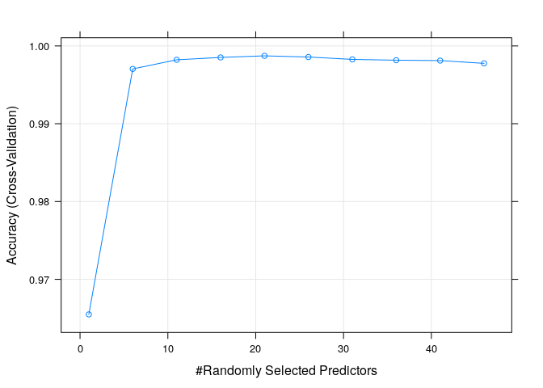
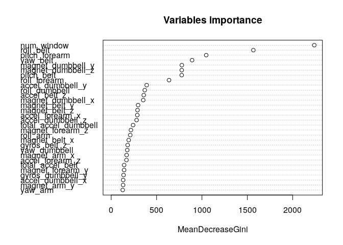

## Executive Summary

Using the dataset provided by HAR (see References) we study if it's possible to predict the class of some weight lifting exercises from a vast set of body measurements.

The report is organized in the following points:
* data exploration and cleaning;
* machine learning models;
* discussion on the results;
* prediction on the test set;
* conclusions.

## Data Preprocessing and Explorartion

We load the csv files into data.tables. Then we get a summary look using the DataExplorer package.


```r
library(data.table)
library(caret)
```

```
## Loading required package: lattice
```

```
## Loading required package: ggplot2
```

```r
trset = fread("pml-training.csv")
teset = fread("pml-testing.csv")
allset = rbind(trset,teset, use.names=FALSE)
trindex = 1:dim(trset)[1]
```


```r
library(DataExplorer)
introduce(allset)
```

```
##     rows columns discrete_columns continuous_columns all_missing_columns
## 1: 19642     160                4                150                   6
##    total_missing_values complete_rows total_observations memory_usage
## 1:              1927102             0            3142720     22430976
```

We can see that the data has a lot of missing values. First we need to remove columns that contain more than 50% of missing data because we can't use them in the analysis.


```r
pMiss <- function(x){sum(is.na(x))/length(x)*100}
tmp = (apply(allset,2,pMiss))
clearset = allset[,tmp < 50,with=FALSE]
introduce(clearset)
```

```
##     rows columns discrete_columns continuous_columns all_missing_columns
## 1: 19642      60                4                 56                   0
##    total_missing_values complete_rows total_observations memory_usage
## 1:                    0         19642            1178520      7166608
```

We can see that now the dataset contains 60 columns, all without missing data. So all the NA's are all concentrated in the 100 columns we removed.

Now let's remove some meaningless columns (datatime ones) and encode the character columns into numeric ones.
As a final step we normalize everything so that the training algorithm can work better.


```r
removeColumns <- grep("timestamp", names(clearset))
clearset <- clearset[,-removeColumns, with = FALSE]

# one-hot encode factor variable
f_user_name = model.matrix(~ as.factor(user_name)-1, data = clearset)
f_new_window = model.matrix(~ as.factor(new_window)-1, data = clearset)
#clearset$classe = as.factor(clearset$classe)
clearset[, V1 := NULL]

# normalize numeric columns
z = apply(clearset[,!c(1,2,56)],2,function(x) (x-min(x))/(max(x)-min(x)))
finalset = data.table(f_user_name, f_new_window, z, "classe" = clearset$classe)

# separate train and test
trset = finalset[trindex,]
teset = finalset[-trindex,]
```

Now we have a training and test dataset ready to analyse.

## Model Introduction and Analysis

We decide to use a random forest model because it can generalize better when having tabular data.
The cross-validation algorithm is a simple 5-fold one, considering that the dataset is not very big.
The tuning of the hyperparameters is done with the help of the caret package.


```r
# seed for reproducibility
set.seed(1234)

# random forest
rfGrid <- expand.grid(mtry = seq(1,50,5))
my_control <-trainControl(method="cv", number=5)
rf_mod <- train(
  x = trset[,!"classe"], 
  y = as.factor(trset[,classe]),
  method = "rf",
  metric = "Accuracy",
  trControl = my_control,
  ntree = 100,
  tuneGrid = rfGrid
)
cat("The random forest model tuned automatically to mtry =", as.numeric(rf_mod$bestTune), " and 100 trees. Final Accuracy = ", max(rf_mod$results$Accuracy), ".\n")
```

```
## The random forest model tuned automatically to mtry = 21  and 100 trees. Final Accuracy =  0.9987259 .
```

```r
rf_mod$finalModel
```

```
## 
## Call:
##  randomForest(x = x, y = y, ntree = 100, mtry = param$mtry) 
##                Type of random forest: classification
##                      Number of trees: 100
## No. of variables tried at each split: 21
## 
##         OOB estimate of  error rate: 0.15%
## Confusion matrix:
##      A    B    C    D    E  class.error
## A 5579    0    0    0    1 0.0001792115
## B    6 3790    1    0    0 0.0018435607
## C    0    7 3415    0    0 0.0020455874
## D    0    0   12 3203    1 0.0040422886
## E    0    0    0    1 3606 0.0002772387
```

## Discussion

We can show how the accuracy varies with the mtry hyperparameter.


```r
plot(rf_mod)
```

<!-- -->

And the most important features are the following.


```r
require(randomForest)
```

```
## Loading required package: randomForest
```

```
## randomForest 4.6-14
```

```
## Type rfNews() to see new features/changes/bug fixes.
```

```
## 
## Attaching package: 'randomForest'
```

```
## The following object is masked from 'package:ggplot2':
## 
##     margin
```

```r
varImp(rf_mod, scale = FALSE)
```

```
## rf variable importance
## 
##   only 20 most important variables shown (out of 61)
## 
##                      Overall
## num_window            2237.7
## roll_belt             1566.3
## pitch_forearm         1047.1
## yaw_belt               891.4
## magnet_dumbbell_y      778.4
## magnet_dumbbell_z      777.5
## pitch_belt             777.0
## roll_forearm           637.6
## accel_dumbbell_y       391.1
## roll_dumbbell          370.0
## accel_belt_z           358.5
## magnet_dumbbell_x      353.3
## magnet_belt_y          296.4
## magnet_belt_z          289.7
## accel_forearm_x        287.5
## accel_dumbbell_z       279.9
## total_accel_dumbbell   241.0
## magnet_forearm_z       217.3
## roll_arm               210.4
## magnet_belt_x          193.0
```

```r
varImpPlot(rf_mod$finalModel, main = "Variables importance")
```

<!-- -->

### Test Results

Let's find the predictions for the test set.


```r
predict(rf_mod, teset[,!"classe"])
```

```
##  [1] B A B A A E D B A A B C B A E E A B B B
## Levels: A B C D E
```

## Conclusion

We have used a random forest model to fit the data. We have found the best hyperparameter for the model based on the accuracy metric, that resulted over 99%.
In conclusion we can say that the predictions are trustworthy. The feature importance analysis also gave insight on the variable that are more important to look when studying weight lifting exercises.

## References

http://groupware.les.inf.puc-rio.br/har
Velloso, E.; Bulling, A.; Gellersen, H.; Ugulino, W.; Fuks, H. Qualitative Activity Recognition of Weight Lifting Exercises. Proceedings of 4th International Conference in Cooperation with SIGCHI (Augmented Human '13) . Stuttgart, Germany: ACM SIGCHI, 2013. 
